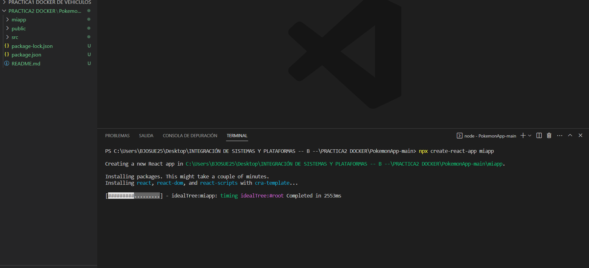
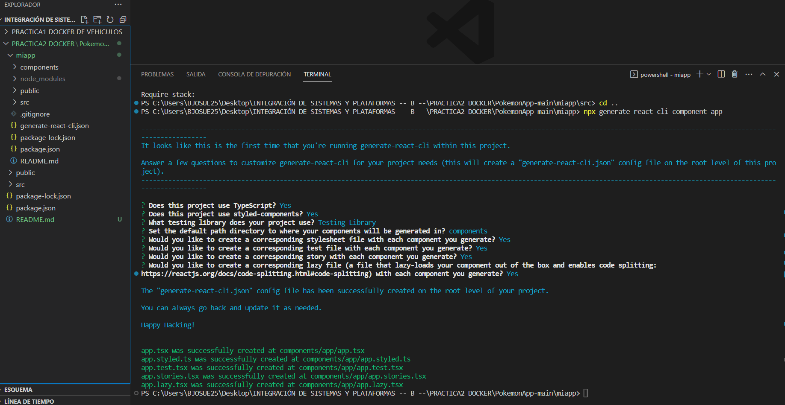
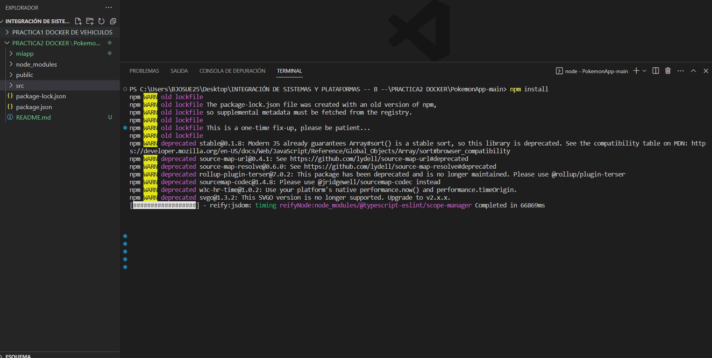
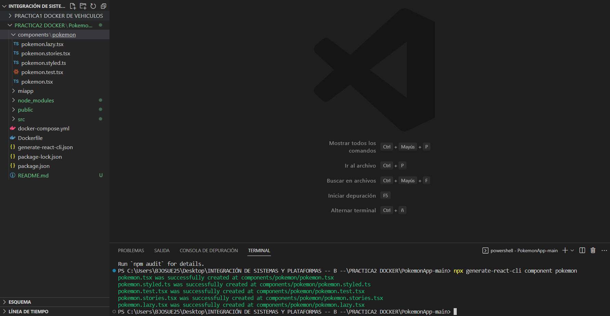
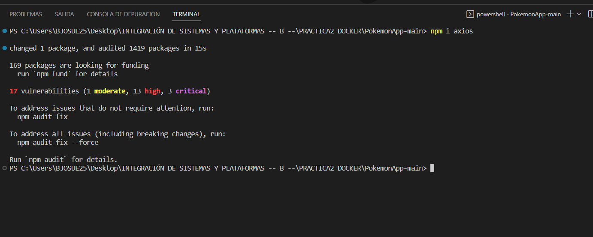
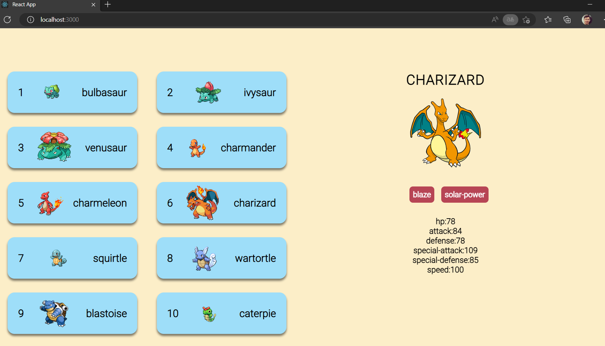
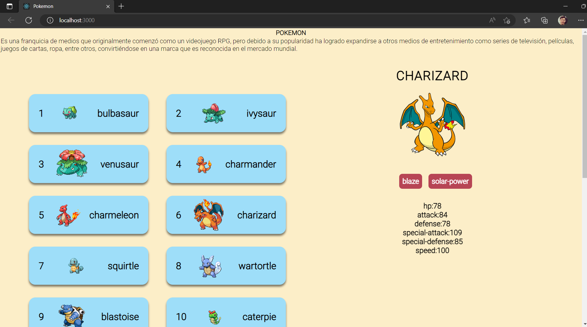
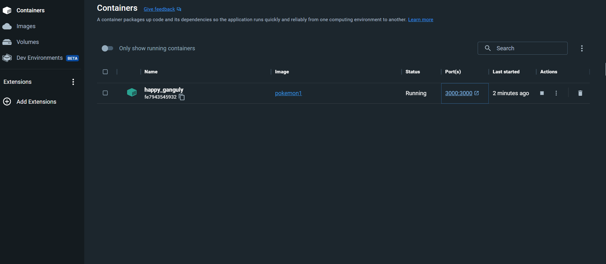

## Explicación 
En esta práctica trabaje con el framework react utilizando una api y cierto comando para los componentes y ciertas instalación, también se trabajo con docker para dockerizar los componentes que se aplico en el desarrollo, se cargo la aplicación funcionando y se permitio en modificar en tiempo real. 

## Screenshots

