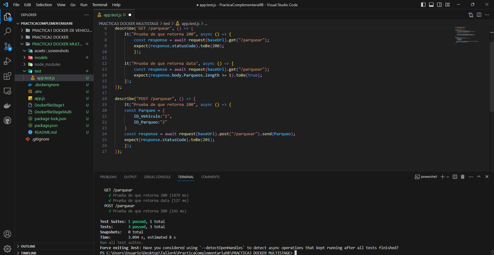
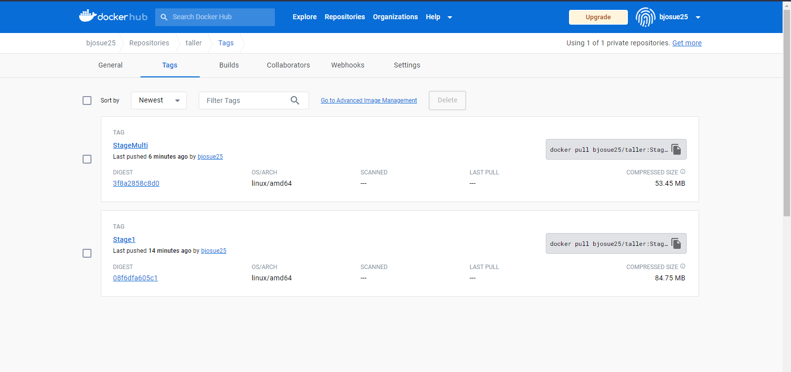
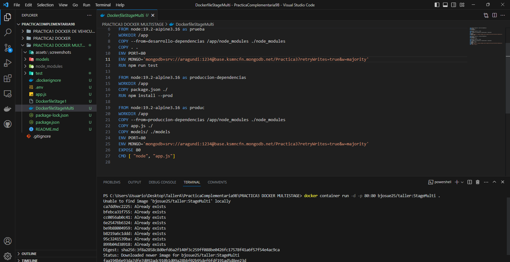

## Explicación 
En esta practica se creo dos contenedores de una api para produccion, utilizando un solo stage y otro utilizando multistage, posteriormente se lo subio a dockerhub para tener la imagen siempre disponible. 

## Comandos usados
docker build --tag bjosue25/taller:StageMulti .  
docker push bjosue25/taller:StageMulti 
docker container run -d -p 80:80 bjosue25/taller:StageMulti .

## Screenshots

