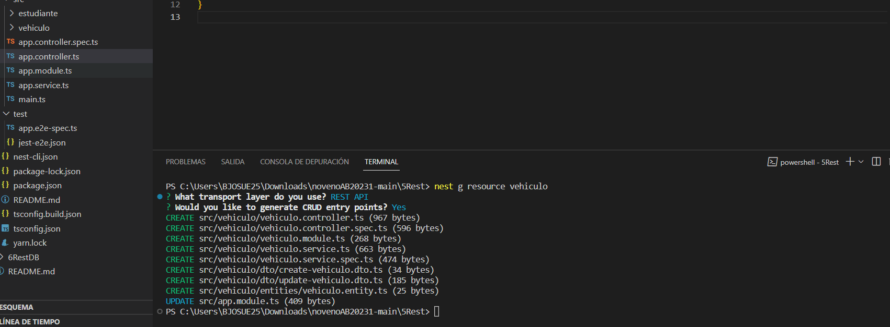
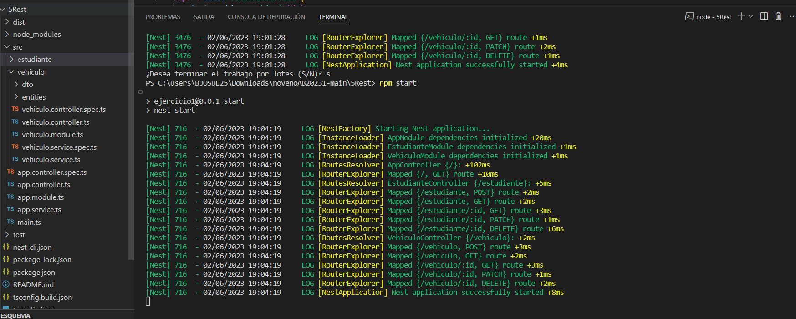
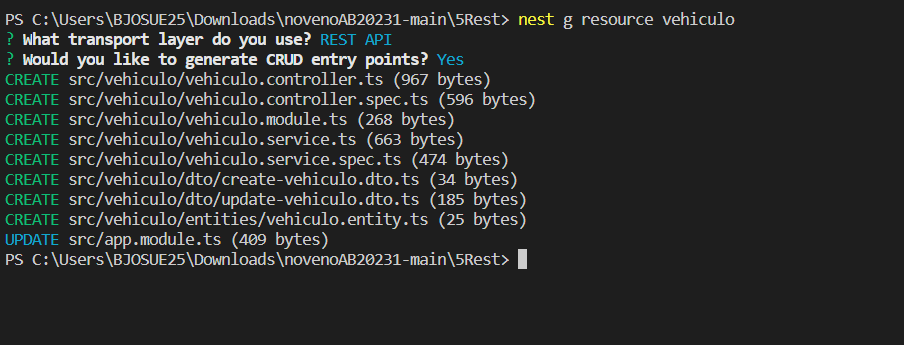
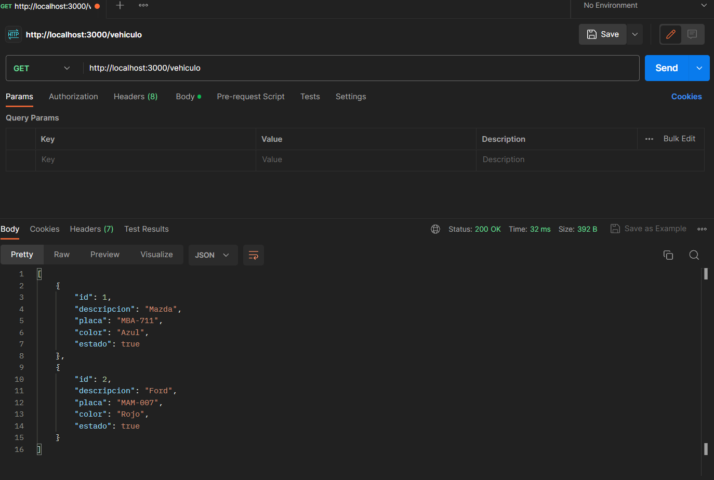
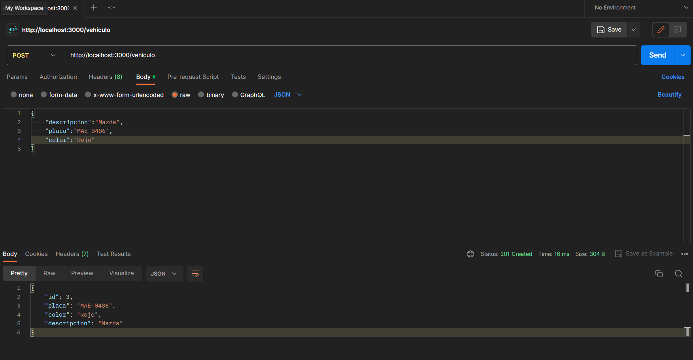
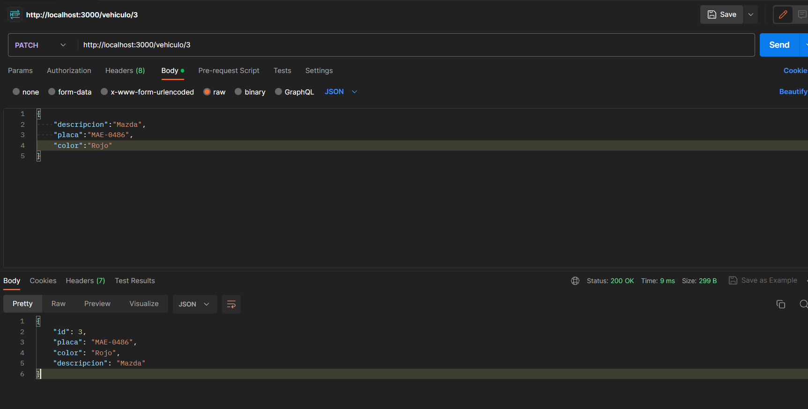
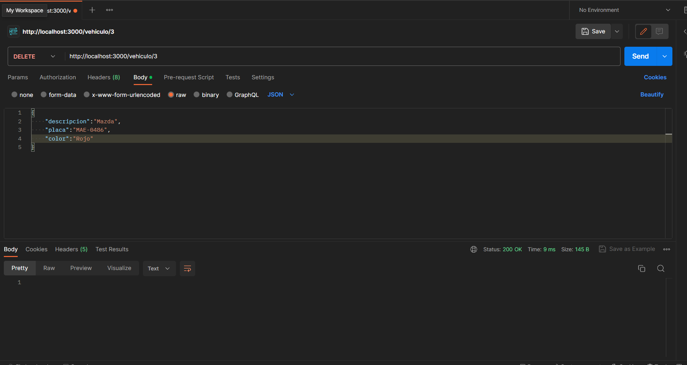

## Explicación 
En esta práctica se trabajo con la entidad y los metodos HTTP. 
## Comandos usados
npm i -g @nestjs/cli   
npm install --global yarn    
nest g resource vehiculo 

## Screenshots

